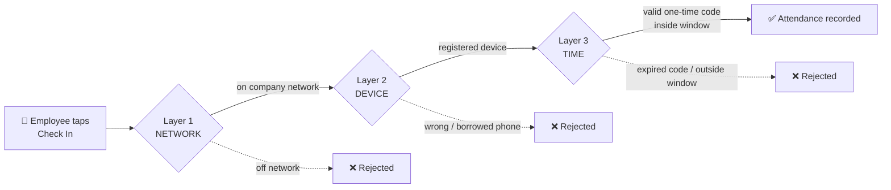

# ⭐ The 3-Layer Verification

> [!important] The whole product in one sentence
> A check-in only counts when **all three layers pass**. Miss one — it doesn't count.

## 🛜 Layer 1 — Network ("are you here?")
Proves the device is physically on the company network.
- **Android:** verifies the **Wi-Fi SSID** against the office fingerprint.
- **iPhone / Web PWA:** browsers can't read the Wi-Fi name, so the backend verifies the device's **public IP** against the office's IP.
- **Self-maintaining:** the office's public IP is **auto-learned** from any Wi-Fi-verified Android check-in — so PWA verification keeps working with zero manual setup, even as IPs change, across unlimited orgs.

## 📱 Layer 2 — Device ("is it really you?")
- Each account **binds to one phone** the first time it's used (`RegisteredDevice`).
- A different or borrowed phone → **rejected** (device mismatch).
- New phone? An admin/super-admin clicks **Reset device**; the next phone used becomes the bound one, and the old one stops working. → [[User Roles]]

## ⏰ Layer 3 — Time ("right now, for real")
- A **short-lived, one-time challenge code** must be entered to check in.
- Defeats scripts, replays, and screenshots of old codes.
- The check-in must also fall inside the **session's open window**; lateness/penalty is measured from the official **opening time**.

## Why it matters
| Threat | Beaten by |
|---|---|
| Clock in from home | Layer 1 (network) |
| Buddy punching / phone sharing | Layer 2 (device) |
| Replaying old codes / scripts | Layer 3 (time code) |

Related: [[Anti-Cheat & Fraud]] · [[Problem & Solution]] · [[Demo Script]]
