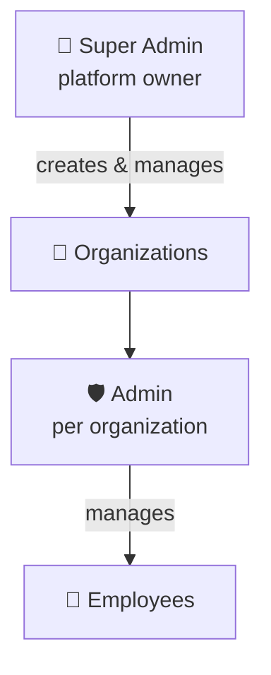

# User Roles

Three roles, enforced server-side by role-based access control (RBAC) and tenant isolation. → [[How It's Clean]]

## 👑 Super Admin — platform owner
**Surface:** [[Platforms & Download Links|Super-Admin web console]]
- Creates organizations and their first admin
- Sees every org & user; can suspend admins, reassign/re-employ employees
- Sets per-office security (public IP, etc.), leave policies
- Reset an employee's bound device for any org
- Sees terminated employees' preserved records

## 🛡️ Admin — runs one organization
**Surface:** [[Platforms & Download Links|Desktop admin app]] (Windows/Linux)
- Opens/locks attendance **sessions**; sees live presence
- Manages employees, departments, offices
- **Reset device** when an employee gets a new phone
- Approves/rejects **leave**; sets **break** policies
- Handles **fraud alerts**; emergency stop-all
- Exports reports (Excel/CSV)

## 👤 Employee — the workforce
**Surface:** [[Platforms & Download Links|Android app]] + [[Platforms & Download Links|iOS/web PWA]]
- Check in / out (passes the [[The 3-Layer Verification|3 layers]])
- Start/end **breaks**
- Request **leave**, view balances
- See today's status + attendance **history**

> [!info] Tenant isolation
> Admins and employees only ever see their **own organization's** data. Every database query is scoped by `orgId`. Super Admin is the only cross-tenant role.

Related: [[Features]] · [[Architecture]] · [[Anti-Cheat & Fraud]]
