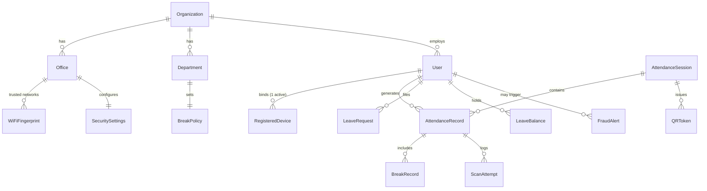

# Data Model

Single Prisma schema over PostgreSQL — the one **data contract** for the whole system.

## Core relationships

## Entity groups (24 models)
**Tenancy & people**
`Organization` · `Office` · `Department` · `User` · `AdminPermission`

**Auth & devices**
`RefreshToken` · `RegisteredDevice` · `WiFiFingerprint`

**Config**
`SecuritySettings` (open/close, grace, penalty, office public IP) · `BreakPolicy`

**Attendance core**
`AttendanceSession` · `QRToken` · `AttendanceRecord` · `ScanAttempt`

**Breaks & leave**
`BreakRecord` · `LeaveRequest` · `LeaveBalance`

**Oversight & ops**
`FraudAlert` · `ScreenshotLog` · `EmergencyControl` · `EmergencyControlSession` · `AttendanceReport` · `NotificationLog`

## Key enums
`UserRole` (SUPER_ADMIN/ADMIN/EMPLOYEE) · `UserStatus` · `AttendanceStatus` (PRESENT/LATE/ABSENT/ON_LEAVE/…) · `LeaveType` · `LeaveStatus` · `BreakType` · `ShiftType` · `ScanResult` · `FraudType` · `SessionStatus` · `AlertStatus` · `AlertSeverity` · `EmergencyAction`

> [!info] Device binding, precisely
> A `RegisteredDevice` row ties an employee to a `deviceFingerprint` with `isActive`. **Reset device** = set the active row `isActive = false`; the next login binds the new phone; the old one then mismatches and is rejected. → [[The 3-Layer Verification]]

Related: [[Architecture]] · [[Anti-Cheat & Fraud]]
